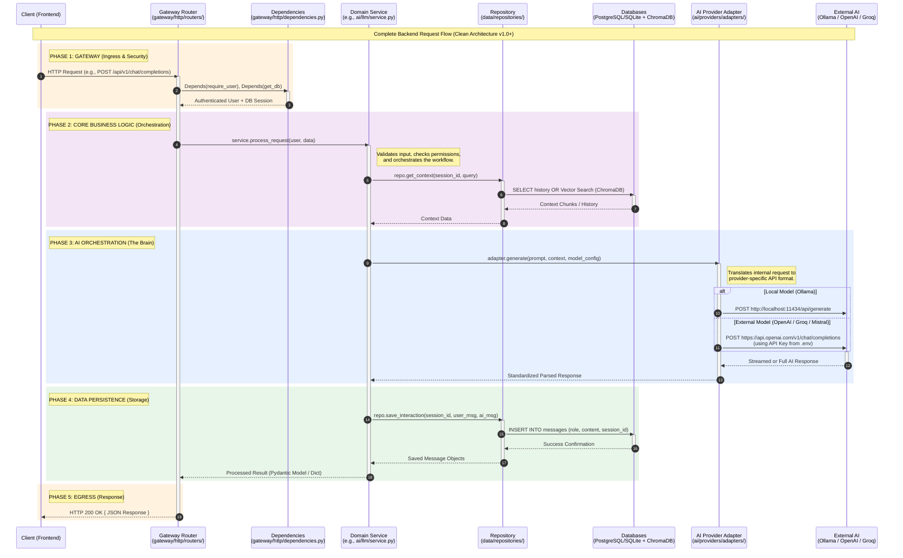
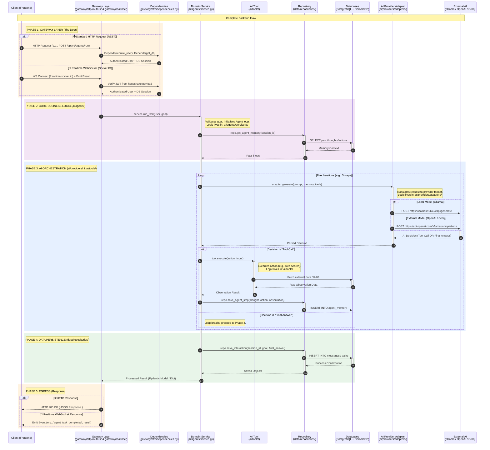

<div align="center">


# Open TutorAI

</div>
<br>
<div align="left">

**OpenTutorAI-CE** (Community Edition) is an open-source project designed to provide an educational and collaborative AI-powered platform. This public edition is the foundation for a proprietary Enterprise Edition (EE) and is built to encourage community contributions.

> [!TIP]

> **Looking for a Support?** – **[Speak with our support Team Today!](mailto:opentutorai@gmail.com)**

> Get **enhanced capabilities**, including **custom theming and branding**, **Service Level Agreement (SLA) support**, **Long-Term Support (LTS) versions**, and **more!**

[](https://github.com/Open-TutorAi/open-tutor-ai-CE)
[](https://github.com/Open-TutorAi/open-tutor-ai-CE)
[](https://github.com/Open-TutorAi/open-tutor-ai-CE)
[](https://github.com/Open-TutorAi/open-tutor-ai-CE/commits)
[](https://discord.gg/BTQtE2deEm)
[](LICENSE)

[📖 Documentation](https://opentutorai.com/docs/intro) · [🚀 Roadmap](https://opentutorai.com/docs/roadmap) · [💬 Discord](https://discord.gg/BTQtE2deEm) · [📧 Enterprise Support](mailto:opentutorai@gmail.com)

</div>

---

## Overview

**OpenTutorAI-CE** (Community Edition) is an open-source, AI-powered educational platform that makes personalized tutoring accessible to everyone. It serves as the foundation for an Enterprise Edition (EE) and is actively maintained by the community.

> **Enterprise Edition available** — includes custom theming & branding, SLA support, LTS versions, and more. [Contact us →](mailto:opentutorai@gmail.com)

---

## ✨ Features

### 🤖 AI & Model Support

- **Ollama & OpenAI-compatible APIs** — connect to LMStudio, GroqCloud, Mistral, OpenRouter, and more
- **Multi-model conversations** — engage multiple models in parallel for optimal responses
- **Model Builder** — create Ollama models, custom agents, and import models with ease
- **Local RAG** — integrate textbooks, notes, and assignments into context-aware tutoring sessions
- **Web Search for RAG** — real-time research via Google PSE, SearXNG, Brave, DuckDuckGo, and more

### 🎓 Personalized Learning

- **Adaptive tutoring support** — tailor the experience to each learner's style and curriculum
- **Personalized LLM + avatar generation** — pair AI personas with individual learner profiles
- **Avatar discussion mode** — lifelike conversational interface for immersive learning

### 🎙️ Rich Interaction

- **Voice, video & avatar modes** — hands-free, multimodal interactions
- **Web browsing** — load live web content into chat using the `#url` command
- **Image generation** — integrated support for AUTOMATIC1111, ComfyUI, and DALL-E

### 🛡️ Security & Access Control

- **Role-Based Access Control (RBAC)** — granular permissions and user groups
- **Human-in-the-loop governance** — LLM response evaluation and self-regulation framework

### 🌍 Platform & UX

- **Docker-first deployment** — single command setup with `:ollama` and `:cuda` images
- **Progressive Web App (PWA)** — offline mode on localhost, installable on mobile
- **Responsive design** — optimized across desktop, tablet, and mobile
- **Multilingual (i18n)** — Arabic, French, English, with community-contributed translations

---

## 🔄 Backend Request Flow

### Current Architecture (v1.0+)



### Target Architecture — Agentic Flow



---

## 🗂️ Project Structure

```
open-tutor-ai-CE/
│
├── main.py                        # Python entry point (uvicorn)
│
├── ── Application Domains ─────────────────────────────────────────
├── accounts/                      # Auth, users, roles, permissions
├── learning/                      # Learners, teachers, classrooms, courses
│   ├── sessions/                  # Chat sessions, tags, sharing, search
│   └── supports/                  # Personalized tutoring supports
├── ai/                            # LLM, providers, RAG, media, memory, tools
│   ├── llm/                       # LLM schemas, service, transports
│   ├── model_catalog/             # Model overlays/catalog
│   ├── providers/                 # OpenAI-compatible + Ollama providers
│   ├── retrieval/                 # RAG pipeline and knowledge bases
│   └── media/                     # Audio (TTS/STT) + image generation
├── content/                       # Files, uploads, learning resources
├── governance/                    # HITL governance and LLM evaluation
│   └── self_regulation/           # Self-regulation feedback domain
├── system/                        # App-level configs and bootstrap
│
├── ── Gateway & Infrastructure ────────────────────────────────────
├── gateway/
│   ├── http/                      # FastAPI app, routers, dependencies
│   └── realtime/                  # Socket.IO ASGI (/realtime/socket.io)
├── data/                          # ORM models, DB engine, base repository
├── config/                        # App settings & constants
├── common/                        # Shared utilities (exceptions, logging)
├── tests/                         # Pytest suite
│
├── ── Frontend ────────────────────────────────────────────────────
├── ui/                            # SvelteKit application
│   ├── src/lib/apis/              # API clients (one folder per domain)
│   ├── src/lib/components/        # Reusable Svelte components
│   ├── src/lib/i18n/              # Translations (AR / FR / EN)
│   ├── src/routes/                # File-based routing
│   ├── static/                    # Assets (avatars, images, audio)
│   └── cypress/                   # E2E tests
│
├── ── DevOps ──────────────────────────────────────────────────────
├── devops/
│   ├── docker/                    # Dockerfiles + Compose overlays
│   └── scripts/                   # Dev & ops shell scripts
│
├── ── Project ─────────────────────────────────────────────────────
├── docs/                          # Documentation
├── kubernetes/                    # Helm charts
├── .github/workflows/             # CI/CD
└── var/                           # Runtime only, gitignored (DB, uploads, vector_db)
```

> Full annotated structure: [MIGRATION.md](MIGRATION.md)

---

## How to Install 🚀

Below is a list of essential steps and resources to help you get started, manage, and develop with Open TutorAI.

### 🛠️ Setup Guide — Local Development (without Docker)

Use this path when you want hot-reload for active development or contribution.

**Requirements:** Python 3.11–3.12 · Node.js 18.13–22.x

1. **Fork and Clone the Repository**
   - Go to [GitHub Repository](https://github.com/Open-TutorAi/open-tutor-ai-CE)
   - Click on **Fork**, then clone your forked repo:
     ```bash
     git clone https://github.com/YOUR_USERNAME/open-tutor-ai-CE.git
     cd open-tutor-ai-CE
     ```

2. **Python Application Setup**
   - Create and activate a Python environment (conda or venv):

     ```bash
     # conda
     conda create -n tutorai-env python=3.11
     conda activate tutorai-env

     # or plain venv
     python3 -m venv .venv && source .venv/bin/activate
     ```

   - Install the required packages:
     ```bash
     pip install -r requirements.txt
     ```
   - Copy and configure environment variables:
     ```bash
     cp .env.example .env
     # The defaults in .env.example work for local dev (DEBUG=true).
     # No changes needed unless you use an external API or want production mode.
     ```
   - Start the Python API with hot-reload (available at **http://localhost:8080**):
     ```bash
     uvicorn main:app --reload --port 8080
     ```
     Or use the provided convenience script:
     ```bash
     chmod +x devops/scripts/dev.sh && ./devops/scripts/dev.sh
     ```
   - Interactive API docs: **http://localhost:8080/docs**

3. **Frontend Setup** _(in a second terminal)_
   - Navigate to the `ui/` folder:
     ```bash
     cd ui
     npm install
     npm run dev        # dev server with hot-reload at http://localhost:5173
     ```

4. **Ollama _(optional — for local models)_**
   - Install from [ollama.com](https://ollama.com), then:
     ```bash
     ollama pull llama3.2
     ```
   - Verify `OLLAMA_BASE_URL=http://localhost:11434` is set in your `.env`.

5. **First login**
   - Open **http://localhost:5173** and create an account.
   - The **first account registered becomes the administrator**.

6. **Run tests** _(no external services required)_
   ```bash
   pytest -q
   ```

---

### 🐳 Docker Compose (Recommended)

**Prerequisites:** Docker + Docker Compose · Git · 8 GB RAM recommended

#### Prerequisites

1. **Docker + Docker Compose** from [docker.com](https://www.docker.com/get-started)
2. **Git** for cloning
3. **At least 8 GB RAM** recommended for AI models

#### Step 1: Clone the Repository

```bash
git clone https://github.com/Open-TutorAi/open-tutor-ai-CE.git
cd open-tutor-ai-CE
```

#### Step 2: Set Up Environment Variables

```bash
cp .env.example .env
```

For **production**, replace the placeholder `SECRET_KEY` in your `.env` with a randomly generated value:

```bash
sed -i.bak "s/^SECRET_KEY=.*/SECRET_KEY=$(openssl rand -hex 32)/" .env && rm .env.bak
```

> For **local development**, the `.env.example` defaults work as-is (`DEBUG=true`).

#### 3. Start the Stack

**With Ollama (local models):**

**With Ollama bundled (recommended for local models):**

```bash
docker compose --env-file .env -f devops/docker/docker-compose.yaml up --build
```

This starts:

- `open-tutorai` — Python API + frontend at **http://localhost:8080**
- `ollama` — local model server at **http://localhost:11434**

**Without Ollama (use an external OpenAI-compatible API):**

```bash
docker compose --env-file .env -f devops/docker/docker-compose.yaml up --build open-tutorai
```

Set `OPENAI_API_BASE_URL` and `OPENAI_API_KEY` in `.env`.

Then in another terminal, you can also start Ollama separately:

```bash
chmod +x devops/scripts/run-ollama-docker.sh
./devops/scripts/run-ollama-docker.sh
```

#### Step 4: Download AI Models (if using Ollama)

```bash
docker exec -it ollama ollama pull llama3.2
```

Verify the model is installed:

```bash
docker exec -it ollama ollama list
```

If the Python API was already running before the model was pulled, restart it:

```bash
docker compose --env-file .env -f devops/docker/docker-compose.yaml restart open-tutorai
```

#### 5. Open the App

Navigate to **http://localhost:8080** — the **first registered account becomes the administrator**.

#### GPU Support

```bash
# NVIDIA
docker compose --env-file .env \
  -f devops/docker/docker-compose.yaml \
  -f devops/docker/docker-compose.gpu.yaml up --build

# AMD
docker compose --env-file .env \
  -f devops/docker/docker-compose.yaml \
  -f devops/docker/docker-compose.amdgpu.yaml up --build
```

#### Stopping / Resetting

```bash
# Stop services
docker compose --env-file .env -f devops/docker/docker-compose.yaml down

# Full reset (removes all data volumes)
docker compose --env-file .env -f devops/docker/docker-compose.yaml down -v
```

---

### 🛠️ Local Development

**Prerequisites:** Python 3.11–3.12 · Node.js 18.13–22.x

#### 1. Fork & Clone

```bash
git clone https://github.com/YOUR_USERNAME/open-tutor-ai-CE.git
cd open-tutor-ai-CE
```

#### 2. Backend Setup

```bash
# Create and activate a virtual environment
python3 -m venv .venv && source .venv/bin/activate
# or with conda:
# conda create -n tutorai-env python=3.11 && conda activate tutorai-env

pip install -r requirements.txt
cp .env.example .env
```

Start the API with hot-reload (available at **http://localhost:8080**):

```bash
uvicorn main:app --reload --port 8080

### ⚙️ Environment Variables Reference

| Variable              | Default                                       | Description                                                                       |
| --------------------- | --------------------------------------------- | --------------------------------------------------------------------------------- |
| `DEBUG`               | `true`                                        | Set to `false` in production. Enables SECRET_KEY strength check.                  |
| `SECRET_KEY`          | _(dev placeholder)_                           | JWT signing key. Required in production (`openssl rand -hex 32`).                 |
| `DATABASE_URL`        | `sqlite:///./var/tutorai.db`                  | SQLAlchemy URL. SQLite for dev, PostgreSQL for production.                        |
| `OLLAMA_BASE_URL`     | `http://localhost:11434`                      | Ollama server. Use `http://ollama:11434` inside Docker Compose.                   |
| `OPENAI_API_BASE_URL` | _(empty)_                                     | OpenAI-compatible API (LMStudio, GroqCloud, Mistral…).                            |
| `OPENAI_API_KEY`      | _(empty)_                                     | API key for the OpenAI-compatible provider.                                       |
| `GEMINI_API_KEY`      | _(empty)_                                     | Google Gemini API key.                                                            |
| `CORS_ALLOW_ORIGIN`   | `http://localhost:3000,http://localhost:5173` | Comma-separated allowed CORS origins.                                             |
| `UPLOAD_DIR`          | `./var/uploads`                               | Directory for uploaded files.                                                     |
| `MAX_UPLOAD_SIZE_MB`  | `100`                                         | Maximum upload size in MB.                                                        |
| `VECTOR_DB_PATH`      | `./var/vector_db`                             | ChromaDB storage path for RAG.                                                    |
| `EMBEDDING_MODEL`     | `sentence-transformers/all-MiniLM-L6-v2`      | Default embedding model for RAG.                                                  |
| `AUDIO_TTS_ENGINE`    | _(empty)_                                     | TTS engine (e.g. `openai`). Configure via Admin > Settings > Audio.               |
| `AUDIO_STT_ENGINE`    | _(empty)_                                     | STT engine. Configure via Admin > Settings > Audio.                               |
| `IMAGES_ENGINE`       | _(empty)_                                     | Image generation engine (e.g. `openai`). Configure via Admin > Settings > Images. |
| `GLOBAL_LOG_LEVEL`    | `INFO`                                        | Log level: `DEBUG`, `INFO`, `WARNING`, `ERROR`.                                   |

> Interactive API docs: **http://localhost:8080/docs**

#### 3. Frontend Setup

```bash
cd ui
npm install
npm run dev    # http://localhost:5173
```

#### 4. Optional: Local Ollama

```bash
# Install from https://ollama.com, then:
ollama pull llama3.2
```

Ensure `OLLAMA_BASE_URL=http://localhost:11434` is set in `.env`.

#### 5. Run Tests

```bash
pytest -q
```

---

## ⚙️ Environment Variables

| Variable              | Default                                       | Description                                                                       |
| --------------------- | --------------------------------------------- | --------------------------------------------------------------------------------- |
| `DEBUG`               | `true`                                        | Set `false` in production. Enables `SECRET_KEY` strength check.                   |
| `SECRET_KEY`          | _(dev placeholder)_                           | JWT signing key. Required in production (`openssl rand -hex 32`).                 |
| `DATABASE_URL`        | `sqlite:///./var/tutorai.db`                  | SQLAlchemy URL. Use PostgreSQL in production.                                     |
| `OLLAMA_BASE_URL`     | `http://localhost:11434`                      | Ollama server. Use `http://ollama:11434` inside Docker Compose.                   |
| `OPENAI_API_BASE_URL` | _(empty)_                                     | OpenAI-compatible API (LMStudio, GroqCloud, Mistral…).                            |
| `OPENAI_API_KEY`      | _(empty)_                                     | API key for the OpenAI-compatible provider.                                       |
| `GEMINI_API_KEY`      | _(empty)_                                     | Google Gemini API key.                                                            |
| `CORS_ALLOW_ORIGIN`   | `http://localhost:3000,http://localhost:5173` | Comma-separated allowed CORS origins.                                             |
| `UPLOAD_DIR`          | `./var/uploads`                               | Directory for uploaded files.                                                     |
| `MAX_UPLOAD_SIZE_MB`  | `100`                                         | Maximum upload size in MB.                                                        |
| `VECTOR_DB_PATH`      | `./var/vector_db`                             | ChromaDB storage path for RAG.                                                    |
| `EMBEDDING_MODEL`     | `sentence-transformers/all-MiniLM-L6-v2`      | Default embedding model for RAG.                                                  |
| `AUDIO_TTS_ENGINE`    | _(empty)_                                     | TTS engine (e.g. `openai`). Configure via Admin → Settings → Audio.               |
| `AUDIO_STT_ENGINE`    | _(empty)_                                     | STT engine. Configure via Admin → Settings → Audio.                               |
| `IMAGES_ENGINE`       | _(empty)_                                     | Image generation engine (e.g. `openai`). Configure via Admin → Settings → Images. |
| `GLOBAL_LOG_LEVEL`    | `INFO`                                        | Log verbosity: `DEBUG`, `INFO`, `WARNING`, `ERROR`.                               |

---

## 🆘 Troubleshooting

<a href="https://www.star-history.com/#Open-TutorAi/open-tutor-ai-CE&Date">
  <picture>
    <source media="(prefers-color-scheme: dark)" srcset="https://api.star-history.com/svg?repos=Open-TutorAi/open-tutor-ai-CE&type=Date&theme=dark" />
    <source media="(prefers-color-scheme: light)" srcset="https://api.star-history.com/svg?repos=Open-TutorAi/open-tutor-ai-CE&type=Date" />
    
  </picture>
</a>

---

## 📜 License

Licensed under the [BSD-3-Clause License](LICENSE).

---

<div align="center">

Founded by [Mohamed El Hajji](https://github.com/pr-elhajji) · Built by the community 💪

**[⭐ Star this repo](https://github.com/Open-TutorAi/open-tutor-ai-CE) · [🐛 Report an issue](https://github.com/Open-TutorAi/open-tutor-ai-CE/issues) · [💬 Join Discord](https://discord.gg/BTQtE2deEm)**

</div>
