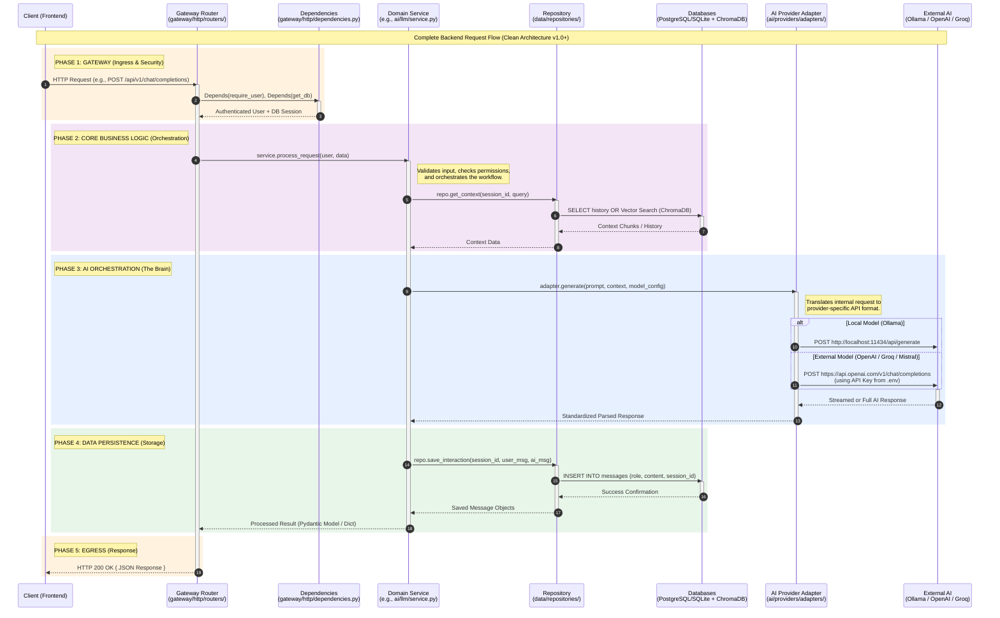
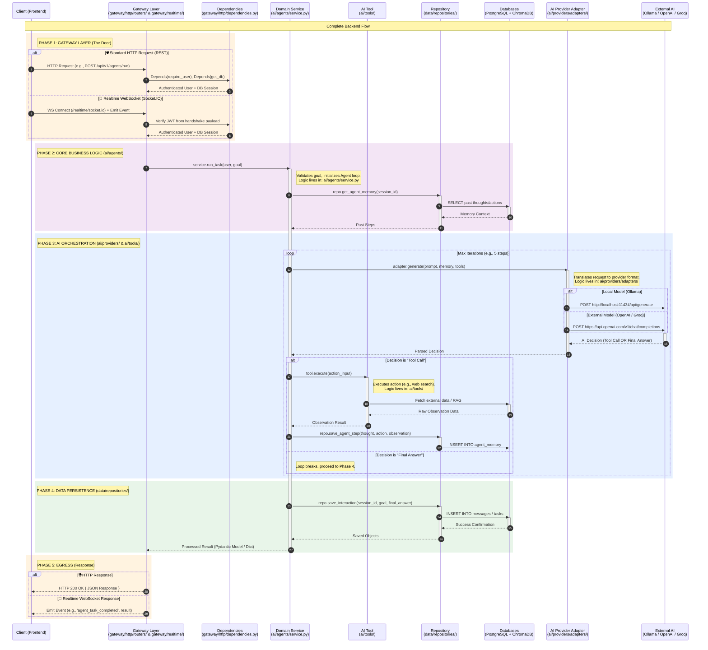

# Project workflow

### Current Architecture (v1.0+)

```mermaid
sequenceDiagram
    autonumber
    participant Client as Client (Frontend)
    participant Router as Gateway Router<br/>(gateway/http/routers/)
    participant Deps as Dependencies<br/>(gateway/http/dependencies.py)
    participant Service as Domain Service<br/>(e.g., ai/llm/service.py)
    participant Repo as Repository<br/>(data/repositories/)
    participant DB as Databases<br/>(PostgreSQL/SQLite + ChromaDB)
    participant AI_Adapter as AI Provider Adapter<br/>(ai/providers/adapters/)
    participant Ext_AI as External AI<br/>(Ollama / OpenAI / Groq)

    Note over Client, Ext_AI: Complete Backend Request Flow (Clean Architecture v1.0+)

    rect rgb(255, 243, 224)
    Note right of Client: PHASE 1: GATEWAY (Ingress & Security)
    Client->>Router: HTTP Request (e.g., POST /api/v1/chat/completions)
    activate Router
    Router->>Deps: Depends(require_user), Depends(get_db)
    activate Deps
    Deps-->>Router: Authenticated User + DB Session
    deactivate Deps
    end

    rect rgb(243, 229, 245)
    Note right of Client: PHASE 2: CORE BUSINESS LOGIC (Orchestration)
    Router->>Service: service.process_request(user, data)
    activate Service
    Note right of Service: Validates input, checks permissions,<br/>and orchestrates the workflow.

    %% Optional: Fetching context/history (RAG or Chat History)
    Service->>Repo: repo.get_context(session_id, query)
    activate Repo
    Repo->>DB: SELECT history OR Vector Search (ChromaDB)
    activate DB
    DB-->>Repo: Context Chunks / History
    deactivate DB
    Repo-->>Service: Context Data
    deactivate Repo
    end

    rect rgb(230, 240, 255)
    Note right of Client: PHASE 3: AI ORCHESTRATION (The Brain)
    Service->>AI_Adapter: adapter.generate(prompt, context, model_config)
    activate AI_Adapter
    Note right of AI_Adapter: Translates internal request to<br/>provider-specific API format.

    alt Local Model (Ollama)
        AI_Adapter->>Ext_AI: POST http://localhost:11434/api/generate
    else External Model (OpenAI / Groq / Mistral)
        AI_Adapter->>Ext_AI: POST https://api.openai.com/v1/chat/completions<br/>(using API Key from .env)
    end
    activate Ext_AI
    Ext_AI-->>AI_Adapter: Streamed or Full AI Response
    deactivate Ext_AI
    AI_Adapter-->>Service: Standardized Parsed Response
    deactivate AI_Adapter
    end

    rect rgb(232, 245, 233)
    Note right of Client: PHASE 4: DATA PERSISTENCE (Storage)
    Service->>Repo: repo.save_interaction(session_id, user_msg, ai_msg)
    activate Repo
    Repo->>DB: INSERT INTO messages (role, content, session_id)
    activate DB
    DB-->>Repo: Success Confirmation
    deactivate DB
    Repo-->>Service: Saved Message Objects
    deactivate Repo

    Service-->>Router: Processed Result (Pydantic Model / Dict)
    deactivate Service
    end

    rect rgb(255, 243, 224)
    Note right of Client: PHASE 5: EGRESS (Response)
    Router-->>Client: HTTP 200 OK { JSON Response }
    deactivate Router
    end
```

### Target Architecture — Agentic Flow

```mermaid
sequenceDiagram
    autonumber
    participant Client as Client (Frontend)
    participant GW as Gateway Layer<br/>(gateway/http/routers/ & gateway/realtime/)
    participant Deps as Dependencies<br/>(gateway/http/dependencies.py)
    participant Service as Domain Service<br/>(ai/agents/service.py)
    participant Tool as AI Tool<br/>(ai/tools/)
    participant Repo as Repository<br/>(data/repositories/)
    participant DB as Databases<br/>(PostgreSQL + ChromaDB)
    participant AI_Adapter as AI Provider Adapter<br/>(ai/providers/adapters/)
    participant Ext_AI as External AI<br/>(Ollama / OpenAI / Groq)

    Note over Client, Ext_AI: Complete Backend Flow

    rect rgb(255, 243, 224)
    Note right of Client: PHASE 1: GATEWAY LAYER (The Door)

    alt 🌐 Standard HTTP Request (REST)
        Client->>GW: HTTP Request (e.g., POST /api/v1/agents/run)
        GW->>Deps: Depends(require_user), Depends(get_db)
        Deps-->>GW: Authenticated User + DB Session
    else 🔌 Realtime WebSocket (Socket.IO)
        Client->>GW: WS Connect (/realtime/socket.io) + Emit Event
        GW->>Deps: Verify JWT from handshake payload
        Deps-->>GW: Authenticated User + DB Session
    end
    end

    rect rgb(243, 229, 245)
    Note right of Client: PHASE 2: CORE BUSINESS LOGIC (ai/agents/)
    GW->>Service: service.run_task(user, goal)
    activate Service
    Note right of Service: Validates goal, initializes Agent loop.<br/>Logic lives in: ai/agents/service.py

    Service->>Repo: repo.get_agent_memory(session_id)
    activate Repo
    Repo->>DB: SELECT past thoughts/actions
    activate DB
    DB-->>Repo: Memory Context
    deactivate DB
    Repo-->>Service: Past Steps
    deactivate Repo
    end

    rect rgb(230, 240, 255)
    Note right of Client: PHASE 3: AI ORCHESTRATION (ai/providers/ & ai/tools/)
    loop Max Iterations (e.g., 5 steps)
        Service->>AI_Adapter: adapter.generate(prompt, memory, tools)
        activate AI_Adapter
        Note right of AI_Adapter: Translates request to provider format.<br/>Logic lives in: ai/providers/adapters/

        alt Local Model (Ollama)
            AI_Adapter->>Ext_AI: POST http://localhost:11434/api/generate
        else External Model (OpenAI / Groq)
            AI_Adapter->>Ext_AI: POST https://api.openai.com/v1/chat/completions
        end
        activate Ext_AI
        Ext_AI-->>AI_Adapter: AI Decision (Tool Call OR Final Answer)
        deactivate Ext_AI
        AI_Adapter-->>Service: Parsed Decision
        deactivate AI_Adapter

        alt Decision is "Tool Call"
            Service->>Tool: tool.execute(action_input)
            activate Tool
            Note right of Tool: Executes action (e.g., web search).<br/>Logic lives in: ai/tools/
            Tool->>DB: Fetch external data / RAG
            activate DB
            DB-->>Tool: Raw Observation Data
            deactivate DB
            Tool-->>Service: Observation Result
            deactivate Tool

            Service->>Repo: repo.save_agent_step(thought, action, observation)
            activate Repo
            Repo->>DB: INSERT INTO agent_memory
            deactivate Repo
        else Decision is "Final Answer"
            Note right of Service: Loop breaks, proceed to Phase 4.
        end
    end
    end

    rect rgb(232, 245, 233)
    Note right of Client: PHASE 4: DATA PERSISTENCE (data/repositories/)
    Service->>Repo: repo.save_interaction(session_id, goal, final_answer)
    activate Repo
    Repo->>DB: INSERT INTO messages / tasks
    activate DB
    DB-->>Repo: Success Confirmation
    deactivate DB
    Repo-->>Service: Saved Objects
    deactivate Repo

    Service-->>GW: Processed Result (Pydantic Model / Dict)
    deactivate Service
    end

    rect rgb(255, 243, 224)
    Note right of Client: PHASE 5: EGRESS (Response)

    alt 🌐 HTTP Response
        GW-->>Client: HTTP 200 OK { JSON Response }
    else 🔌 Realtime WebSocket Response
        GW-->>Client: Emit Event (e.g., 'agent_task_completed', result)
    end
    end
```

## Design notes

- [Responsible AI notification design](responsible-ai-notifications.md)
